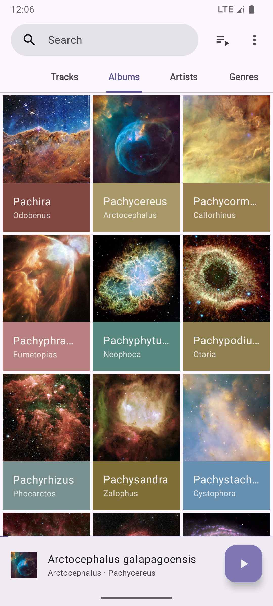

image:metadata/en-US/images/phoneScreenshots/00-screenshot-home-tracks.png[Screenshot,15%]

image:metadata/en-US/images/phoneScreenshots/02-screenshot-home-folders.png[Screenshot,15%]

image:metadata/en-US/images/phoneScreenshots/04-screenshot-player.png[Screenshot,15%]

A modern offline music player with familiar designs for Android 11+.

This project aims to be a replacement with personal tweaks for the now-defunct https://github.com/kabouzeid/Phonograph[Phonograph] music player, but has no connections with it.

Phocid is not officially available on Google Play or other app stores except https://f-droid.org/en/packages/org.sunsetware.phocid/[F-Droid]. I don't provide support for unauthorized repackaged versions, and you should report repackagers who violate GPL.

== Features

* Familiar user experience
* Better metadata support; Namely, multiple artists.
* Better sorting when your music library differs from your system language
* Regex-based blocklist
* Playback speed and pitch control
* More lyrics styles
* Optional less-vibrant colors
* Brand new design based on Material Design 3

== Missing features compared to Phonograph

=== Features that are intentionally left out

* Tag editing
+
The scene of audio file tagging is a disaster.
The best metadata support library I could find is still buggy; I recommend using well-known dedicated software for this task.
* Deleting files
* Anything that requires an internet connection
* Lock screen
* Playback statistics
* Widgets
* Notification customization

